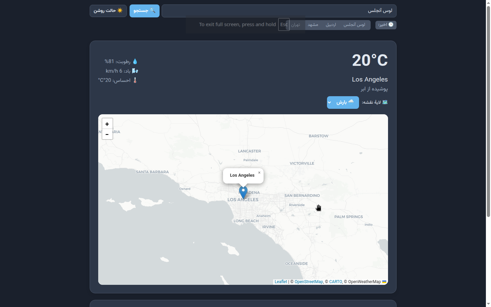

# 🌤️ Weather App | اپلیکیشن آب‌وهوا

A stylish weather web app with interactive map layers, 24-hour forecast chart, and Persian city name support.  
یک وب‌اپلیکیشن زیبا و کاربردی برای نمایش آب‌وهوا، مجهز به نقشه با لایه‌های دما و بارش، نمودار ۲۴ ساعته و پشتیبانی از جستجوی شهرهای فارسی.

## 🚀 Live Demo | نسخهٔ آنلاین
Check it out without any installation:  
[**Live Demo**](https://mrmohammadarjmand-dev.github.io/weather/weather.html)

---

## ✨ Features | امکانات

- 🔍 Search cities in **Persian (فارسی)** or English (e.g., "اردبیل", "Tehran")
- 🌡️ Real-time temperature, humidity, wind speed, and feels-like temperature
- 🗺️ Interactive map with switchable weather layers:
  - **🌡️ Temperature** (heatmap from OpenWeatherMap)
  - **🌧️ Precipitation radar** (live rain/snow from RainViewer)
  - **☁️ Clouds** (currently disabled – informative message shown)
- 📈 24-hour temperature forecast chart (Chart.js)
- 🕒 Recent search history (saved in browser, up to 4 items)
- 🌙 Dark / Light mode toggle
- ⏱️ Smart timeout & error messages (suggests using a VPN if data fails to load)

---

## 🛠️ Tech Stack | تکنولوژی‌ها

- **Frontend:** HTML5, CSS3, Vanilla JavaScript
- **Map:** [Leaflet.js](https://leafletjs.com/)
- **Charts:** [Chart.js](https://www.chartjs.org/)
- **Geocoding:** [OpenStreetMap Nominatim](https://nominatim.org/) (for Persian city names)  
- **Weather Data:** [OpenWeatherMap API](https://openweathermap.org/api)  
- **Radar Layer:** [RainViewer](https://www.rainviewer.com/)  
- **Base Map Tiles:** [CARTO](https://carto.com/attributions)  
- **Font:** [Vazirmatn](https://github.com/rastikerdar/vazirmatn) via Google Fonts

---

## 📸 Screenshots | تصاویر

> **Take a screenshot of the app** (e.g., searching for "اردبیل") and save it as `screenshot.png` in the repository root. It will automatically appear here.

---

## ⚠️ Important Notes | نکات مهم

- **VPN / Filtering:** Some APIs (OpenWeatherMap, Nominatim) may be restricted in certain networks. If data doesn't load, try using a VPN or changing your connection.
- **Cloud Layer:** The cloud map tile from OpenWeatherMap is currently unavailable due to regional restrictions. Selecting the "Cloud" layer displays a friendly notice.
- **API Key:** The included API key is for demo purposes. For production, get your own from [OpenWeatherMap](https://openweathermap.org/api).

---

## 🤝 Contributing | مشارکت

Suggestions and pull requests are welcome! Feel free to open an issue for any bug or feature request.  
پیشنهادات و مشارکت شما خوشحالم می‌کند. اگر باگی دیدید یا ایده‌ای دارید، یک Issue یا Pull Request ایجاد کنید.

---

**ساخته شده با ☕ و عشق به دنیای وب**  
Made with ❤️ by [Mohammad Arjmand](https://github.com/mrmohammadarjmand-dev)
